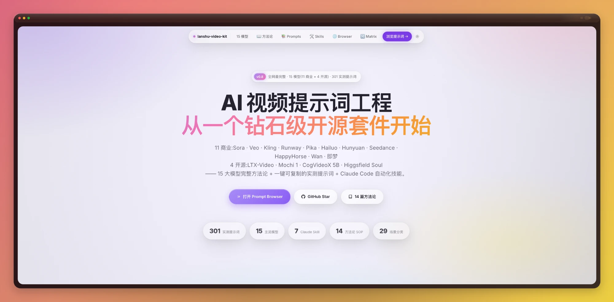

<div align="center">

<!-- Hero Banner -->
<picture>
  <source media="(prefers-color-scheme: dark)" srcset="https://capsule-render.vercel.app/api?type=waving&color=gradient&customColorList=12,2,30&height=200&section=header&text=lanshu-awesome-ai-video-kit&fontSize=42&fontColor=ffffff&fontAlignY=38&desc=AI%20Video%20Prompt%20Engineering%20Kit%20·%2016%20Models%20·%20431%20Prompts&descSize=15&descAlignY=62&descColor=cccccc">
  
</picture>

# 🎬 lanshu-awesome-ai-video-kit

**做企业 AI 视频项目逼出来的开源工具包**

431 实测 prompt · 16 模型 · 7 Claude Skill · 16 篇方法论 · GitHub Action 每周自动监控官方端点

[🇨🇳 中文](README.md) · [🇬🇧 English](README.en.md) · [🌐 **Live Demo**](https://lanshu-awesome-ai-video-kit.lank.workers.dev) · [⚡ awesome 投稿](awesome.md)

---

<!-- Project status badges -->
[](https://opensource.org/licenses/MIT)
[](https://awesome.re)
[](CONTRIBUTING.md)
[](https://github.com/cclank/lanshu-awesome-ai-video-kit/commits)
[](https://github.com/cclank/lanshu-awesome-ai-video-kit/stargazers)
[](https://github.com/cclank/lanshu-awesome-ai-video-kit/network/members)
[](https://github.com/cclank/lanshu-awesome-ai-video-kit/issues)

<!-- Content stats badges -->
[](#-15-模型一览)
[](prompts/)
[](skills/)
[](methodology/)
[](prompts/data/all-prompts.json)
[](.github/workflows/model-version-monitor.yml)

<!-- Tech stack + deployment badges -->
[](#)
[](tools/)
[](scripts/)
[](https://lanshu-awesome-ai-video-kit.lank.workers.dev)
[](https://lanshu-awesome-ai-video-kit.lank.workers.dev)

</div>

---

## 📸 主页一瞥

<div align="center">
  
  <p><i>v0.9.0 主页 · Liquid Glass 风格 · mesh 渐变 + 浮动胶囊 nav + 暗/亮主题</i></p>
</div>

---

## ✨ 为什么是这个项目

市面上"AI 视频 prompt 大全"类内容很多,但通常有 3 个问题:

| 问题 | 这个仓库怎么解 |
|---|---|
| ❌ **来源不明** — 不标谁写的、在哪个模型上测过 | ✅ 每条 prompt 必带 `source` 字段,链到官方文档 / 测评博客 |
| ❌ **过期失效** — 2024 的写法在 2026 的模型上跑不出来 | ✅ GitHub Action 每周一巡检 32 个官方端点,版本变化自动开 issue |
| ❌ **混杂厨房** — 公式七拼八凑 | ✅ 每个模型独立按其官方公式(Sora Shot List / Veo 8 元素 / Kling 5 层 / ...)收录 |

---

## 🎯 数据规模(v0.9.0 · 2026-05)

```
431 条 prompt   (321 单模型最佳实践 + 110 跨模型对照矩阵)
 15 个 模型      (11 商业旗舰 + 4 开源 / 友好开源)
  7 个 Claude Skill  (含 model-selector + prompt-translator 跨模型核心)
 16 篇 方法论 SOP    (基础公式 → 各家公式 → 决策树 → masterclass → Gemini Omni)
 29 个 场景分类      (产品 / 对话 / 物理 / I2V / 武侠 / 萌宠 / ...)
 32 个 监控端点      (每周一 09:00 北京时间自动巡检)
   3 个 Web 工具    (Liquid Glass · 零依赖单文件 HTML)
  55+ 文件         (~640 KB)
中英 双 README    + awesome 投稿稿
```

---

## 🚀 5 秒上手

```bash
git clone https://github.com/cclank/lanshu-awesome-ai-video-kit
cd lanshu-awesome-ai-video-kit
python3 serve.py 8000
# 浏览器打开 http://localhost:8000/
```

`serve.py` 比 `python3 -m http.server` 多三件事:`.md` 自动 redirect 到 viewer 渲染、UTF-8 charset 强制、开发期禁缓存。

---

## 📑 目录

- [✨ 为什么是这个项目](#-为什么是这个项目)
- [🎯 数据规模](#-数据规模v090--2026-05)
- [🚀 5 秒上手](#-5-秒上手)
- [📦 15 模型一览](#-15-模型一览)
- [🛠️ 7 个 Claude Code Skill](#%EF%B8%8F-7-个-claude-code-skill)
- [📖 16 篇方法论 SOP](#-16-篇方法论-sop)
- [🌐 3 个 Web 工具](#-3-个-web-工具)
- [🤖 自动监控机制](#-自动监控机制)
- [📁 目录结构](#-目录结构)
- [🤝 贡献](#-贡献)
- [🙏 致谢](#-致谢)
- [📜 License](#-license)

---

## 📦 15 模型一览

> 📅 **2026 年 5 月版本** · 数据每月人工 review + GitHub Action 每周巡检

### 🏢 11 商业模型

| 模型 | 厂商 | 看家本领 | 时长 | 中文 | 音频 | 物理 |
|---|---|---|---|---|---|---|
| **Seedance 2.0** ⭐ | 字节 · 火山方舟 | **综合 SOTA · 53 页官方 PDF · 8 要素公式 · 即梦底层** | 60s 2K | ★★★ | ★★★ | ★★★ |
| **HappyHorse 1.0** | 阿里巴巴 | 紧凑短片专精 + 30-55 词 + 8s 时序节拍 + 原生环境音 | 15s（默认 5s） | ★★★ | ★★ | ★★ |
| **Kling 3.0** | 快手 · 可灵 | **S 级** · 中文 + 图生视频 + 48fps 1080p + lip-sync | 2m | ★★★★★ | ★★★★ | ★★★★ |
| **Veo 3.1** | Google DeepMind | **S 级** · 原生音频最强 + 多人对话 | 148s chained | ★★ | ★★★★★ | ★★★ |
| **Sora 2** ⚠️ | OpenAI | 电影艺术片 + Cameos · **⚠️ web/app 已停 2026-04-26** | 25s (Pro) | ★★ | ★★★★ | ★★★★★ |
| **Runway Gen-4.5 / Aleph** | Runway | **ELO 综合第一** + Aleph 视频编辑独家 | 10s / Aleph 5s | ★★★ | — | ★★★ |
| **Pika 2.5** | Pika Labs | 性价比之王 + Pikaffects 15+ 创意特效 | 25s | ★★ | ★ | ★★ |
| **Hailuo 02** | MiniMax | **物理仿真业界第一** + 1080p | 10s | ★★★ | — | ★★★★★ |
| **Hunyuan Video 1.5** | 腾讯 | 开源最强商业版(13B/8.3B)+ LoRA + RTX 4090 可跑 | 10s | ★★★★ | — | ★★★ |
| **Wan 2.7** | 阿里通义 | **数字人 lip-sync 最准** · Wan 2.6 OSS / 2.7 最新 | 15s | ★★★ | ★★★★★ | ★★★ |
| **即梦 AI** | 字节剪映 | 中文最强 + 剪映集成(底层 Seedance 2.0) | 60s 2K | ★★★★★ | ★★★ | ★★★ |

### 🔓 4 大开源 / 开源友好

| 模型 | 协议 | 看家本领 | 时长 |
|---|---|---|---|
| **LTX-Video 0.9.7** | Apache 2.0 | **实时生成** · 5s 视频 5s 内出 · 30 FPS | 10s |
| **Mochi 1** | Apache 2.0 | **10B 最大开源** AsymmDiT · 强 prompt 遵循 | 5.4s |
| **CogVideoX 5B / 1.5** | Apache 2.0 | 智谱清华出品 · 226 token 长 prompt · T2V/I2V 双权重 | 10s |
| **Higgsfield Soul / DoP** | 部分开源 | **Soul ID 角色一致性** + Soul Cinema | 15s / 60s 长片 |

→ 不会选?让 Claude 帮你 → [skills/model-selector](skills/model-selector/SKILL.md)
→ 详细对比 → [methodology/13-六大模型公式速查.md](methodology/13-六大模型公式速查.md) + [methodology/14-四大开源模型速查.md](methodology/14-四大开源模型速查.md)

---

## 🛠️ 7 个 Claude Code Skill

按 [Anthropic 官方 SKILL.md 标准](https://code.claude.com/docs/en/skills.md),每个 Skill 独立目录 + YAML frontmatter。**一行安装**:

```bash
for s in seedance-prompter seedance-storyboard seedance-debugger \
         happyhorse-prompter kling-prompter \
         model-selector prompt-translator; do
  ln -s "$(pwd)/skills/$s" ~/.claude/skills/$s
done
```

| Skill | 触发场景 | 输出 |
|---|---|---|
| ★ [`model-selector`](skills/model-selector/SKILL.md) | "用哪个模型好" / "Sora 还是 Kling" / "哪个能本地部署" | 推荐 1-3 个模型 + 理由(覆盖全 15 模型) |
| ★ [`prompt-translator`](skills/prompt-translator/SKILL.md) | "把这条 Sora prompt 转成 Kling 写法" | 目标模型公式 + 字段映射表 + 110 条基准查表 |
| [`seedance-prompter`](skills/seedance-prompter/SKILL.md) | "做个 Seedance 视频" | 8 要素结构化 prompt |
| [`seedance-storyboard`](skills/seedance-storyboard/SKILL.md) | "把剧情拆成分镜" | 3-5 个分镜 + 4 维度组织 |
| [`seedance-debugger`](skills/seedance-debugger/SKILL.md) | "我的 prompt 出问题了" | 12 类诊断 + 修复版 |
| [`happyhorse-prompter`](skills/happyhorse-prompter/SKILL.md) | "5/10/15 秒紧凑短片" | 30-55 词 + 原生音频路径 |
| [`kling-prompter`](skills/kling-prompter/SKILL.md) | "可灵 / 图生视频 / 中文剧情" | 三套写法自适应 |

---

## 📖 16 篇方法论 SOP

按主题分六组:

| # | 类别 | 文档 |
|---|---|---|
| 01-08 | **通用 + Seedance 体系** | 基础公式 / 进阶 8 要素 / 分镜时序 / 情绪外化表 / 运镜词典 / 约束词清单 / 特殊字符规范 / 避坑 12 问 |
| 09-12 | **三家独立公式** | Kling 三套写法 + 6 守则 / 跨 5 模型对比 / Sora 2 Shot List / Veo 3.1 8 元素 |
| 13 | **6 大商业模型速查** | Runway / Pika / Hailuo / Hunyuan / Wan / 即梦 一锅端 |
| 14 | **4 大开源速查** ⭐ | LTX / Mochi / CogVideoX / Higgsfield + 15 模型选型决策树 |
| 15 | **Seedance Masterclass** ⭐ | 10 YouTube 教学(500K+ 播放):9 要素 / Timeline / 角色一致性 5 步 / 5 种爆款 / VFX / Bullet Time / 8 个模板 |
| 16 | **Gemini Omni 公式** ⭐NEW | Google AI 官方 5 大 prompting tips(Real-World 锚点 / 文字渲染 / 摄影术语 / 迭代编辑 / 动作改) + 10 条官方样板 |

> **如果只挑两篇必读**:[`02-进阶 8 要素`](methodology/02-进阶公式.md)(导演级写作框架,所有 prompt 都是它的变体)+ [`13-六大模型公式速查`](methodology/13-六大模型公式速查.md)(12 分钟拿到 6 个模型公式)。其他 14 篇按需查。

---

## 🌐 3 个 Web 工具

整个仓库的网页层**零依赖单文件 HTML**,GitHub Pages 直接跑。8 个页面统一 Liquid Glass 主题(mesh 渐变 + 浮动胶囊 nav + 暗/亮主题 localStorage 跨页同步)。

| 工具 | 路径 | 卖点 |
|---|---|---|
| **Prompt Browser** | [`tools/prompt-browser/`](tools/prompt-browser/) | 431 prompt 浏览器 · 15 模型彩虹筛选 · URL 状态分享 · 键盘导航(`/`/`j`/`k`/`Enter`/`c`)|
| **Cross-Model Matrix** ★ | [`tools/cross-model/`](tools/cross-model/) | 10 场景 × 11 模型 = 110 横向对照 · `prompt-translator` 的查表基准 |
| **Markdown Viewer** | [`viewer.html`](viewer.html) | 所有 .md 文件渲染成漂亮 web 文档 · 自动 TOC + 代码高亮 |

---

## 🤖 自动监控机制

模型迭代太快,人记不住 — 仓库自己醒着:

```yaml
# .github/workflows/model-version-monitor.yml
schedule:
  - cron: '0 1 * * 1'    # 每周一 UTC 01:00 = 北京时间 09:00
```

[`scripts/monitor_models.py`](scripts/monitor_models.py) 跑过 **32 个端点**(GitHub Releases atom / HuggingFace Model Card / 官方 prompt guide),SHA-256 hash 比对内容变化 → 任何端点变了自动开 GitHub Issue。

`model_endpoints.yaml` 里的 `noise_patterns` 过滤 timestamp / csrf-token / nonce 噪音,避免误报。

---

## 📁 目录结构

```
lanshu-awesome-ai-video-kit/
├── README.md                       # 本文件(中文)
├── README.en.md                    # English README
├── awesome.md                      # awesome 列表投稿稿
├── RESOURCES.md                    # 15 模型官方文档汇总
├── CONTRIBUTING.md                 # 贡献指南
├── CHANGELOG.md                    # 版本历史 v0.1 → v0.9.0
├── LICENSE                         # MIT
├── serve.py                        # 本地 dev server(UTF-8 + .md redirect)
│
├── prompts/
│   ├── data/all-prompts.json       # 单一数据源(431 条)
│   ├── data/cross-model-matrix.json # 110 条跨模型对照
│   └── {seedance,happyhorse,kling,sora,veo}/README.md
│
├── methodology/                    # 16 篇方法论 SOP
│   ├── 01-基础公式.md ~ 08-避坑12问.md
│   ├── 09-kling-公式.md ~ 12-veo-公式.md
│   ├── 13-六大模型公式速查.md
│   └── 14-四大开源模型速查.md      ⭐
│
├── skills/                         # 7 个 Claude Code Skill
│   ├── model-selector/SKILL.md     ⭐ 15 模型购物顾问
│   ├── prompt-translator/SKILL.md  ⭐ 跨模型转换(110 条基准)
│   └── {seedance-*,happyhorse,kling}-*/SKILL.md
│
├── scripts/                        # GitHub Action 监控
│   ├── monitor_models.py
│   ├── model_endpoints.yaml        # 32 端点配置
│   └── requirements.txt
│
├── .github/
│   ├── workflows/model-version-monitor.yml  # 每周一巡检
│   └── ISSUE_TEMPLATE/             # 4 个贡献表单
│
├── tools/
│   ├── prompt-browser/             # 431 prompt 浏览器
│   └── cross-model/                # 跨模型对照矩阵
│
├── viewer.html                     # Markdown viewer
├── assets/
│   ├── site-theme.css              # 8 页面共享 Liquid Glass 主题
│   └── site-theme.js               # 跨页主题切换
│
└── docs/
    └── screenshots/                # 项目截图(README 引用)
```

---

## 🤝 贡献

欢迎贡献,每个入口都有表单引导:

- 🟢 [新增一条 prompt](.github/ISSUE_TEMPLATE/new-prompt.yml)(最高频,最简单)
- 🎬 [上传实测视频填 110 个跨模型槽位](.github/ISSUE_TEMPLATE/test-video-contribution.yml)
- 🔴 [告诉我新模型 / 新版本](.github/ISSUE_TEMPLATE/new-version-or-model.yml)(GitHub Action 也会自动 catch,但人工眼睛更准)
- 🟡 写一篇新方法论 / 一个新 Skill(直接 PR)

详细 schema:[CONTRIBUTING.md](CONTRIBUTING.md)

---

## 🙏 致谢

按权威度排序:

| 来源 | 贡献 |
|---|---|
| 🟢 [OpenAI Cookbook](https://developers.openai.com/cookbook/examples/sora/sora2_prompting_guide) | Sora 2 官方分层公式 |
| 🟢 [Google DeepMind](https://deepmind.google/models/veo/prompt-guide/) | Veo 3.1 官方 8 元素公式 |
| 🟢 火山方舟 53 页 PDF | Seedance 2.0 完整方法论 |
| 🟢 [Atlabs AI](https://www.atlabs.ai/blog/kling-3-0-prompting-guide-master-ai-video-generation) | Kling 5 层公式 |
| 🟢 [Runway Help · Gen-4](https://help.runwayml.com/hc/en-us/articles/39789879462419-Gen-4-Video-Prompting-Guide) / [Aleph](https://help.runwayml.com/hc/en-us/articles/43277392678803-Aleph-Prompting-Guide) | 视频编辑专门公式 |
| 🟢 [Lightricks LTX-Video](https://github.com/Lightricks/LTX-Video) | LTX 0.9.7 实时生成 |
| 🟢 [Genmo Mochi 1](https://github.com/genmoai/mochi) | 10B 开源 AsymmDiT |
| 🟢 [智谱 CogVideoX](https://github.com/zai-org/CogVideo) | 中国开源 + I2V 专门权重 |
| 🟢 [Higgsfield AI](https://higgsfield.ai/) | Soul ID + DoP 模板 |
| 🟡 8+ 高质量测评博客 | Imagine.art / Atlas Cloud / CrePal / Elser AI / GeekVibes 等补充示例 |

完整资源:[RESOURCES.md](RESOURCES.md)

---

## 📜 License

[MIT](LICENSE) — prompt 内容来自公开文档,仅供教育与研究。各模型版权归各家所有(字节 / 阿里 / 快手 / OpenAI / Google / Runway / Pika / MiniMax / 腾讯 / 字节剪映 / Lightricks / Genmo / 智谱 / Higgsfield)。

---

<div align="center">

**⭐ Star** 一下,如果它帮到你了 · **🌟 v0.9.0** · **📅 2026-05**

Made with ❤️ by [@lanshu](https://github.com/cclank) · CHANGELOG: [v0.9.0](CHANGELOG.md)

[⬆️ 回到顶部](#-lanshu-awesome-ai-video-kit)

</div>
